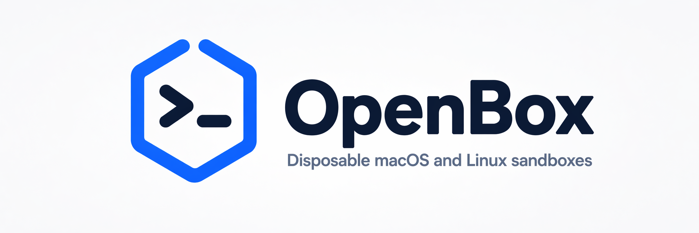
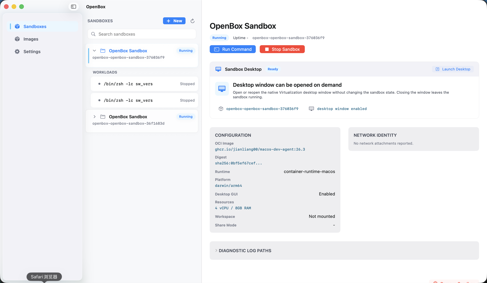
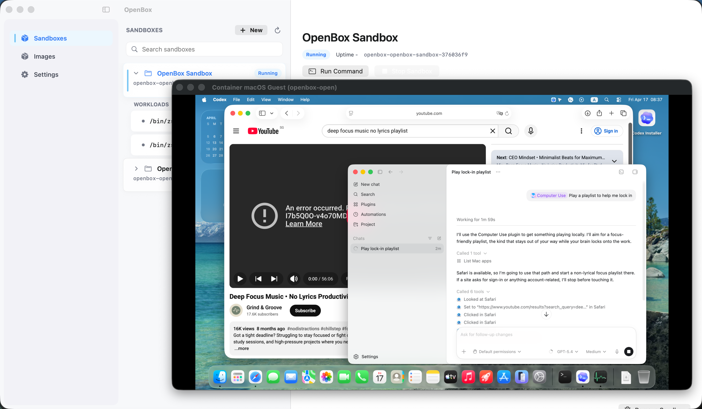

<p align="center">
  
</p>

<p align="center">
  <a href="https://github.com/jianliang00/open-box/releases/latest"></a>
  <a href="https://github.com/jianliang00/open-box/releases"></a>
  <a href="LICENSE"></a>
  
  
</p>

---

**A desktop app for creating and managing isolated Mac environments.**

OpenBox gives Mac users a visual way to create, start, stop, inspect, and
remove sandboxes. Its main focus is full-featured macOS isolated environments:
launch a macOS guest sandbox, open its desktop session, run commands, and use an
embedded terminal from one app.

Ready-to-use images make the first sandbox quick to launch.

[Download the latest DMG](https://github.com/jianliang00/open-box/releases/latest)
| [Compatibility](docs/COMPATIBILITY.md)

> OpenBox is early alpha software for people who want safe, isolated macOS
> sandboxes on Apple Silicon.

## Showcase

<table>
  <tr>
    <td width="50%">
      
    </td>
    <td width="50%">
      
    </td>
  </tr>
</table>

## Why OpenBox

AI agents are getting better at operating computers, running commands, editing
files, testing apps, and exploring unfamiliar workflows. OpenBox gives them a
dedicated place to explore: a disposable macOS sandbox for commands, app tests,
installs, and experiments.

OpenBox keeps the agent's desktop, files, credentials, browser state, and work
setup separate from your everyday Mac.

- Create and manage isolated Linux or macOS sandboxes from a visual interface.
- Launch full macOS guest environments with keyboard, pointer, graphics, and
  desktop session support.
- Start from ready-to-use images for a quick first run.
- Run terminal commands inside the sandbox.
- Start, stop, inspect, and remove sandboxes when an experiment is done.
- Keep logs and diagnostics accessible for each sandbox.

OpenBox is most useful for AI exploration, command-line tasks, app testing, and
recoverable experiments in a dedicated Mac environment.

## Quick Start

1. Use an Apple Silicon Mac running macOS 26 or later.

2. Download the latest DMG from
   [GitHub Releases](https://github.com/jianliang00/open-box/releases/latest).

3. Open the DMG and drag `OpenBox.app` to `/Applications`.

4. Launch OpenBox.

5. Choose a ready-to-use image or add your own image reference, create a
   sandbox, then start it from the sandbox detail view.

6. For supported macOS guest sandboxes, enable desktop GUI when creating the
   sandbox, then open the desktop session or terminal from the detail view.

For source builds, see [Build From Source](#build-from-source).

## Compatibility

OpenBox follows the runtime requirements of Apple's container stack.

| Area | Current status |
| --- | --- |
| Hardware | Apple Silicon Mac |
| Runtime OS | macOS 26 or later |
| Source build | Xcode 26 or later |
| Linux sandboxes | Supported through Linux-compatible container images |
| macOS guest sandboxes | Supported when the image/runtime supports `container-runtime-macos` |
| Linux desktop sessions | Future area |
| Interactive terminal | Currently focused on supported macOS guest sandboxes |

The Xcode project currently has `MACOSX_DEPLOYMENT_TARGET=15.5`. The embedded
container services follow Apple's upstream `container` and `Containerization`
requirements, which currently document macOS 26 as their supported
runtime/build target. See [docs/COMPATIBILITY.md](docs/COMPATIBILITY.md) for
the full compatibility note.

## Build From Source

```sh
git clone git@github.com:jianliang00/open-box.git
cd open-box
open OpenBox.xcodeproj
```

Then in Xcode:

1. Resolve Swift package dependencies.
2. Select the `OpenBox` scheme.
3. Build or run the app.

The app embeds its container runtime during the Xcode build using
[`Scripts/embed-container-runtime.sh`](Scripts/embed-container-runtime.sh). If
you are developing against a local container checkout, set:

```sh
export OPENBOX_CONTAINER_PACKAGE_DIR=/path/to/container
```

before building.

## Dependency Notes

OpenBox currently pins a fork of
[`apple/container`](https://github.com/apple/container) through
[`jianliang00/container`](https://github.com/jianliang00/container). The pinned
revision is intentional while OpenBox depends on app-embedded runtime
integration work. The lower-level
[`apple/containerization`](https://github.com/apple/containerization)
dependency remains Apple's official package, as resolved through the pinned
container checkout.

All dependency versions and revisions are pinned in
`OpenBox.xcodeproj/project.xcworkspace/xcshareddata/swiftpm/Package.resolved`.

## Project Structure

- `OpenBox/` contains the SwiftUI app, state model, container SDK service, and
  embedded terminal view.
- `OpenBoxTests/` contains focused unit tests for image parsing, runtime state,
  terminal behavior, and service helpers.
- `OpenBoxUITests/` currently contains launch smoke-test scaffolding.
- `Scripts/embed-container-runtime.sh` builds and embeds the container runtime
  products into the app bundle.
- `docs/` contains compatibility notes, brand assets, and screenshots.

## Releases

Pushing a semantic version tag such as `1.0.0` triggers the GitHub Actions
release workflow. The workflow builds the Release app on a macOS 26 runner,
packages `OpenBox-<tag>.dmg`, signs and notarizes the DMG, and attaches it to a
GitHub Release.

Latest release:
[github.com/jianliang00/open-box/releases/latest](https://github.com/jianliang00/open-box/releases/latest)

## Development Status

OpenBox is in the `0.0.x` line and should be treated as alpha software. The
near-term focus is reducing setup friction, clarifying compatibility, hardening
runtime reliability, and replacing placeholder UI tests with real workflow
coverage.

## License

OpenBox is licensed under the Apache License 2.0. See [LICENSE](LICENSE).
